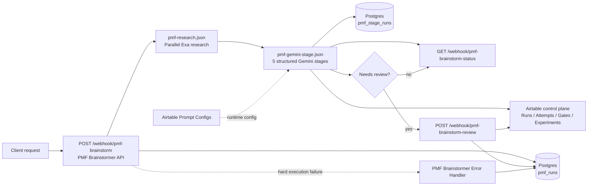

# PMF Brainstormer

`PMF Brainstormer` is a portfolio-grade `n8n` automation system for turning a raw product idea into a structured PMF scorecard. It is designed to show advanced orchestration patterns rather than simple trigger-action automation:

- async webhook intake with polling status
- modular `Execute Workflow` subflows
- Airtable-driven prompt/runtime config with code fallback
- multi-stage LLM analysis with deterministic schema validation
- explicit error workflow, gate-control workflow, and stage-level logging
- Postgres audit ledger plus Airtable operator control plane

## Architecture

The live system is split into four imported entry workflows:

- `PMF Brainstormer API`
- `PMF Brainstormer Status API`
- `PMF Brainstormer Review API`
- `PMF Brainstormer Error Handler`

The parent workflow executes three local-file subflows from the repo:

- `workflows/subflows/pmf-research.json`
- `workflows/subflows/pmf-gemini-stage.json`
- `workflows/subflows/pmf-airtable-control-plane.json`



Execution flow:

1. `POST /webhook/pmf-brainstorm` accepts a request and immediately returns `202`.
2. The API workflow creates a durable run in Postgres.
3. Exa research runs first, then five Gemini stages run sequentially.
4. Before each Gemini stage, the Airtable control-plane subflow attempts to load the active prompt config for that stage and falls back to the repo default if needed.
5. Each stage writes structured attempt logs, including provider/model/schema/config metadata.
6. Final synthesis either auto-completes the run or moves it to `awaiting_review`.
7. `POST /webhook/pmf-brainstorm-review` records an operator decision and resolves the run.
8. `GET /webhook/pmf-brainstorm-status?run_id=<run_id>` returns run state, final output, and gate metadata.
9. Any hard failure triggers the dedicated error workflow, which marks the run failed.

## Reliability Model

- Gemini responses are constrained with `responseJsonSchema`.
- Returned JSON is validated again in code against the resolved stage schema, not just for missing keys.
- Stage config can come from Airtable `Prompt Configs`, but invalid or missing config falls back to the code-defined default.
- External HTTP calls use retry-on-fail settings.
- Stage attempts are idempotently persisted with `(run_id, stage_key, attempt)` uniqueness.
- Final runs and Airtable records use upsert-style behavior to reduce duplicate operator state.
- Degraded runs surface warnings and explicit review-gate metadata instead of failing silently.

## Airtable Control Plane

The control plane is optional in local development and active when `AIRTABLE_CONTROL_PLANE_ENABLED=true`.

Suggested linked tables:

- `Runs`
- `Stage Attempts`
- `Gate Decisions`
- `Experiments`
- `Prompt Configs`

`Prompt Configs` is now runtime-active. It can override stage prompt template, schema, fallback payload, model, temperature, and retry count. See [airtable-control-plane.md](docs/airtable-control-plane.md).

For the fastest working setup, use the importable Airtable templates in [fixtures/airtable/](fixtures/airtable/) and follow [airtable-setup.md](docs/airtable-setup.md).

## Repo Layout

- `docker-compose.yml`: local runtime for `n8n + Postgres`
- `.env.example`: local configuration template
- `postgres/init/`: bootstrap SQL and incremental migrations
- `scripts/generate-workflows.mjs`: workflow generator
- `scripts/create-backup-bundle.mjs`: workflow export/backup helper
- `workflows/entrypoints/`: import these into n8n
- `workflows/subflows/`: loaded from disk by the parent workflow
- `docs/`: architecture, Airtable, deployment, handoff, case-study, and screenshot notes
- `fixtures/`: sample API payloads and Airtable seed data

## Local Setup

1. Copy `.env.example` to `.env`.
2. Fill in `GEMINI_API_KEY` and `EXA_API_KEY`.
3. Change `N8N_BASIC_AUTH_PASSWORD` from the placeholder value before you expose the stack anywhere.
4. Set `AIRTABLE_CONTROL_PLANE_ENABLED=true` only if you want live Airtable sync and runtime prompt config.
5. Start the stack:

```bash
docker compose up -d
```

6. Open `http://localhost:5678`.
7. On first run, complete n8n's owner-account setup page.
8. Create one `Postgres` credential in n8n using the values from `.env`.
   Default values from `.env.example`:
   Host: `postgres`
   Port: `5432`
   Database: `n8n`
   User: `n8n`
   Password: `n8n`

If your Postgres volume already existed before the runtime-control-plane upgrade, apply the extra migrations once:

```bash
set -a
source .env
set +a
docker compose exec -T postgres psql -U "$POSTGRES_USER" -d "$POSTGRES_DB" -f /docker-entrypoint-initdb.d/002_control_plane_state.sql
docker compose exec -T postgres psql -U "$POSTGRES_USER" -d "$POSTGRES_DB" -f /docker-entrypoint-initdb.d/003_runtime_control_plane.sql
```

## Generate And Import Workflows

Regenerate the workflow JSON whenever prompts, schema rules, or control-plane logic change:

```bash
node scripts/generate-workflows.mjs
```

Import these four files into n8n:

- `workflows/entrypoints/pmf-brainstorm-api.json`
- `workflows/entrypoints/pmf-brainstorm-status.json`
- `workflows/entrypoints/pmf-brainstorm-review.json`
- `workflows/entrypoints/pmf-error-handler.json`

Then do the manual bindings:

1. Attach your single `Postgres` credential to every Postgres node in the imported workflows.
2. In `PMF Brainstormer API`, set `Settings -> Error Workflow -> PMF Brainstormer Error Handler`.
3. Activate `PMF Brainstormer API`, `PMF Brainstormer Status API`, and `PMF Brainstormer Review API`.
4. The error-handler workflow is referenced from settings and does not need its own active toggle.

Gemini, Exa, and Airtable use env vars and do not require n8n UI credentials in this repo version.

## Test The API

Create a run:

```bash
curl -X POST http://localhost:5678/webhook/pmf-brainstorm \
  -H 'Content-Type: application/json' \
  -d @fixtures/request.valid.json
```

Poll status:

```bash
curl "http://localhost:5678/webhook/pmf-brainstorm-status?run_id=<run_id>"
```

Resolve a gated run:

```bash
curl -X POST http://localhost:5678/webhook/pmf-brainstorm-review \
  -H 'Content-Type: application/json' \
  -d @fixtures/request.review.json
```

## Handoff And Backups

- [architecture.md](docs/architecture.md) explains the workflow topology.
- [portfolio-case-study.md](docs/portfolio-case-study.md) is the public-facing case-study narrative.
- [airtable-setup.md](docs/airtable-setup.md) is the exact Airtable bootstrap guide with field types and env steps.
- [handoff.md](docs/handoff.md) covers import order, credentials, Airtable setup, and restore steps.
- [screenshot-checklist.md](docs/screenshot-checklist.md) lists the strongest artifacts to capture for the public repo and portfolio.
- `node scripts/create-backup-bundle.mjs` exports workflows, docs, fixtures, and migrations into `workflow-backups/`.

## Portfolio Publishing

For the portfolio version of this project, the public proof should stay simple:

- public GitHub repo
- workflow screenshots
- Mermaid diagrams
- Airtable screenshots

No public frontend deployment is required.

## Optional Live Demo

If you later want a runnable demo, deploy only the backend stack:

- `n8n + Postgres` on a VPS with Docker Compose
- Airtable as the external operator database

See [deployment.md](docs/deployment.md).

## Public Repo Hygiene

- Keep any private planning or brainstorming documents out of the public repo.
- Do not publish `.env`.
- Rotate any API keys that were ever stored in a local `.env` before making the repo public.
- Keep job-specific application drafting material outside the public repo.
